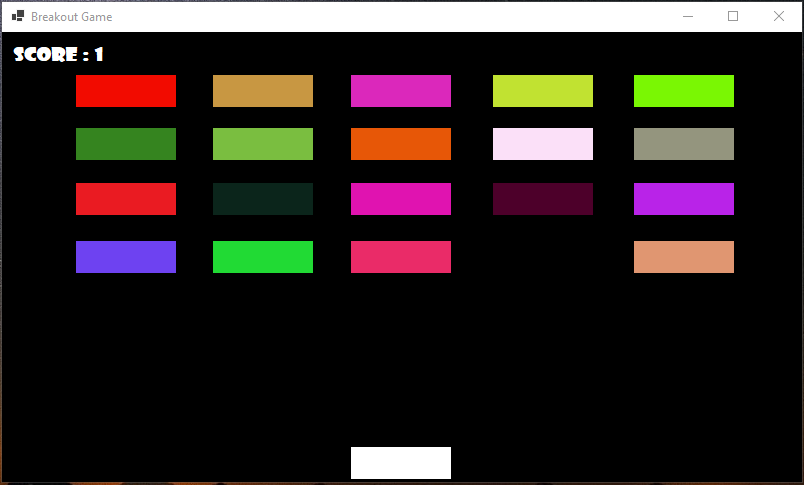

# 🎮 C# Game Project

A fun and interactive game built using **C#** with engaging gameplay and smooth performance. Designed to demonstrate clean code architecture, efficient game loops, and user-friendly UI.

---

## 📷 Screenshots

### 🏠 Home Screen



---

## 🚀 Features

- 🕹️ Smooth gameplay mechanics
- 🎨 Custom graphics and animations
- 🎵 Background music & sound effects
- 💾 Save and load game progress
- 🧩 Multiple levels and challenges

---

## 🧱 Tech Stack

- **Language:** C#
- **IDE:** Visual Studio
- **Assets:** Custom-made / Free-to-use assets

---


## 📌 How to Run

1. Clone the repository:
   ```bash
   git clone https://github.com/your-username/your-game-repo.git
